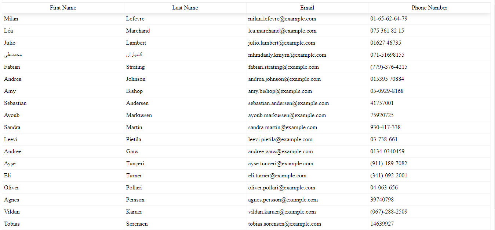

# Employee Directory

### Welcome to my [Employee Directory](https://bnguyen467.github.io/employee-directory/)

# Description

This react application allows users to view entire employee directory at once. The users will be able to see employee's basic information, sort, or filter the table by first name, last name, email, or phone number.

# Installation:

1. Clone the folder from github
2. In the terminal, run the command "npm i"
3. To run the application, run the command "npm start"

## Questions

Find me on github: [bnguyen467](https://github.com/bnguyen467)
Contact me through email: 467bnguyen@gmail.com

## To view the application, [click here](https://bnguyen467.github.io/employee-directory/)

